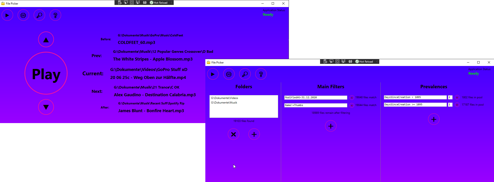
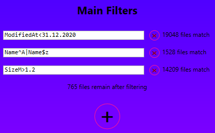
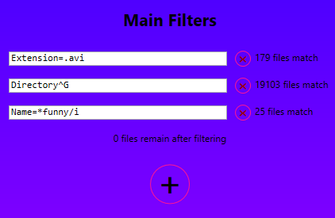
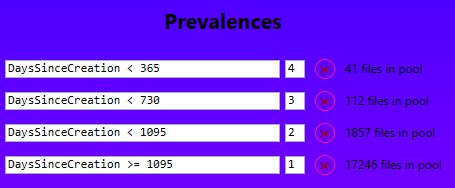
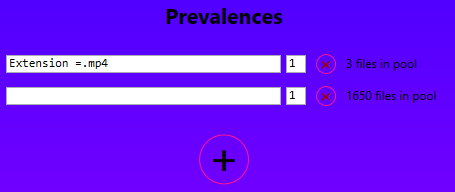
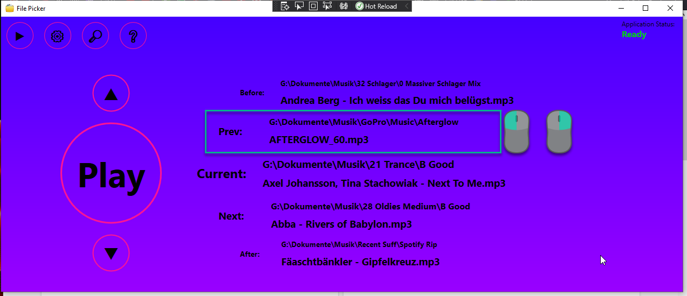

# Toms Random File Picker

 

This tool allows you to select random files from your filesystem. It supports
- considering just the folders you want
- filter the files by a lot of custom properties, such as name or size
- adding prevalences, i.e. certain files can occur more often than others.

# Setup
Download the latest release from here: [Releases](https://github.com/Tom852/FilePicker/releases). Select the `FilePicker.zip` and unpack it wherever you want. Run the exe to start the program.
First, you see the settings page. On the left, you can add the folders with the files you want to choose from. Subfolders are automatically included.
In the center, you can add filters. Filtering is explained below. On the right, you can set your prevalences, which also use filter terms and are also explained below.

Once set, you have to press the lupe to scan your data structure. When ready, you can press the play button to go to the programs main page. From there, you can open your files randomly according to your settings.

# Filtering
After you selected your folders in the settings page, you can add filters. This means, you can kick out files you don't want. Each filter you define must be met (they are connected AND-wise). This tool uses the Gridify library for filtering. The library translates text to code which the tool can execute, so to speak. The following paragraphs are a bit theoretical, but there are examples later on, which make everything clearer!

## Properties
When defining a filter, you can use the following properties:

|       Property        |         Example          |                Comment                |
| :-------------------: | :----------------------: | :-----------------------------------: |
|       Directory       |        C:\MyFiles        |  Path, without a trailing backslash   |
|         Name          |        coolVideo         |          Just the file name           |
|       Extension       |           .avi           |          Starting with a dot          |
|       FullPath        | C:\MyFiles\coolVideo.avi | Path, FileName and Extension combined |
|       CreatedAt       |       31.12.2021*        |       Date format is localized!       |
|   DaysSinceCreation   |           456            |                                       |
|      ModifiedAt       |        1.1.2022*         |       Date format is localized!       |
| DaysSinceLastModified |           455            |                                       |
|         SizeB         |          40008           |       Size in Bytes as integer        |
|         SizeK         |         39.0703          |          Size in KB as float          |
|         SizeM         |          0.0381          |          Size in MB as float          |
|         SizeG         |        0.0000372         |          Size in GB as float          |
 
Note that CreatedAt and ModifiedAt are tricky properties. If you copy all data on your drive to another, say from a backup drive, the created-at date gets reset to the present day for all your files. The modify-date may be better in this case.
Also note that the date-formats are localized. If you are from America, you may write 12/31/2021. Above, we saw the German format.

## Operators
With the properties above, you wanna do something. For example  "Name is equal to ..." or "SizeK is larger than ...". For this, the following operators are available:
| Name                  | Operator | Usage example          |
| --------------------- | :------: | ---------------------- |
| Equal                 |   `=`    | `"FieldName = Value"`  |
| NotEqual              |   `!=`   | `"FieldName !=Value"`  |
| LessThan              |   `<`    | `"FieldName < Value"`  |
| GreaterThan           |   `>`    | `"FieldName > Value"`  |
| GreaterThanOrEqual    |   `>=`   | `"FieldName >=Value"`  |
| LessThanOrEqual       |   `<=`   | `"FieldName <=Value"`  |
| Contains - Like       |   `=*`   | `"FieldName =*Value"`  |
| NotContains - NotLike |   `!*`   | `"FieldName !*Value"`  |
| StartsWith            |   `^`    | `"FieldName ^ Value"`  |
| NotStartsWith         |   `!^`   | `"FieldName !^ Value"` |
| EndsWith              |   `$`    | `"FieldName $ Value"`  |
| NotEndsWith           |   `!$`   | `"FieldName !$ Value"` |

## Logic
Maybe you want to combine expressions. The following logic operators are available:
| Name        | Operator            | Usage example                                                     |
| ----------- | ------------------- | ----------------------------------------------------------------- |
| AND         | `,`                 | `"Field1=Value,Field2=Value2"`                                    |
| OR          | <code>&#124;</code> | <code>"Field1=Value&#124;Field2=Value2"</code>                    |
| Parenthesis | `()`                | <code>"(Field1=*Jo,Field2<30)&#124;(Field1!=Hn,Field2>30)"</code> |

## Special
Adding a `/i` after a string makes it case-insensitive.
Leaving a filter term completely empty interpretes it as "true for anything".

## Escaping and more
Please refer to the [Gridify docs](https://alirezanet.github.io/Gridify/guide/filtering.html#conditional-operators). I'm anyway just copying their doc :D.

## Examples
### Example 1

 

 Here we only keep files that
 - were last modified before the 31st of December in 2020. Note that the date format is localized. If you are from America, you may enter 12/31/2020! Just try it until it works :)
 - The Name of the file shall start with *A* or end with *z*.
 - Size must be larger than 1.2 Megabytes.

765 files meet all conditions and are handed to the prevalence section.

### Example 2
 
 

 Here we only keep files that
 - have the extension avi (note the dot - if you don't write the dot, you can use the `$` operator instead)
 - Directory starts with G, which is the drive letter in this case.
 - Name must contain funny, or Funny, or funnY, or FuNny, or FuNNY, or.... 

Although some files mach each individual condition, none matches all. The play button is greyed out.

# About prevalences
## Basics
In the prevlance section, you can make settings to let some files appear more often than others. A real world example would be to prefer newer files. Consider the following example:
 
 

 This reads as follows:
 - In 4 out of 10 (=4+3+2+1) cases, a file from the 1st pool is picked. A file newer than one year.
 - In 3 out of 10 (=4+3+2+1) cases, a file from the 2nd pool is picked. A file newer than two years.
 - In 2 out of 10 (=4+3+2+1) cases, a file from the 3rd pool is picked. A file newer than three years.
 - In 1 out of 10 (=4+3+2+1) cases, a file from the 4th pool is picked. A file older than three years.

## Exclusivity Pitfall
 Note that the pools are not exclusive to each other. The second pool, when defined as above, contains also the files that are in the first pool. So does the third pool, it contains the files from both, the first and the second pool. This means it can be, that although the third pool is picked, a file newer than one year comes up. This is defined poorly by the user. More correct would be to define the second pool as `DaysSinceCreation < 730, DaysSinceCreation >= 365` and the third pool accordingly.

## Relative Prevalence Pitfall
Consider the following example:

 

 The first pool is very small, whereas the second pool contains many more files (all that were not prefiltered). But both pools have a prevalence of 1, which means, each pool is picked alternately. This further means, that every other time, one of those 3 files in the first pool is picked. It is to expect that (on average) after 6 file hits, those three files will start to repeat!

 The setting above does NOT mean, that each file is equally likely! Think of it as file-pools. A small pool means that files in this pool will repeat briefly.

# Tipps and Tricks
## Mouse Shortcuts
LeftClick any file from *Before* to *After* to play (open) it again. Right click it to open it in Explorer.

 

## OldDataFromDb - the heck?
The tool shall scale for large amounts of files. Scanning all files is necessary before filtering to read their sizes and modify dates. As you may note, this takes a while when scanning 10k files or more. If you want to access the functionality quickly, it may be annoying to rescan the data structure over and over. Especially if nothing changes. Long story short: After program startup, the data from the last scan is loaded to not force you into a file-rescan. If files got moved, deleted, renamed or created in the meantime, those will not be detected and will cause errors. Rescan manually to be up to date.

## Files are not picked up
Windows seems to cache you file data structure. You will also notice that the first file scan takes a while, but the 2nd scan is like instantaneous. This means, if you scan, create a file, and scan again, your created file may not be picked up. I don't know what helps here other than a system reboot.